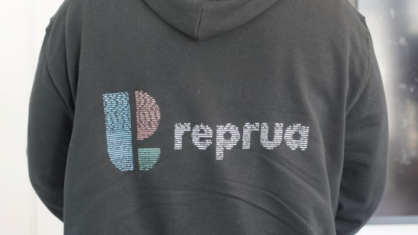

# 私と Quine の出会いと別れ、そして再会

2025/03/13 tyamap

---

# 山下智矢 Yamashita Tomoya

- やまぴー・ぴーやま・ぴーさん
- 趣味
  - 読書・映画・ラーメン・ボドゲ・ポーカー
- 経歴
  - 文学部出身の本の虫
  - 2019 ~ 中小 SIer
  - 2021 ~ 株式会社 InnerResource
  - 2025 ~ 株式会社メドレー

---

# Quine とは

> 自身のソースコードと完全に同じ
> 文字列を出力するプログラム


---

# Quine との出会いと別れ

- 初参加・単身参加した RubyKaigi 2024 の Keynote で初めて知る
  - 感動し、Rubyの面白さに引き込まれた
- `puts "puts 'puts'..."`

--- 

# そして感動の再会

- 前職を退職する時に Quine でサービスロゴが書かれたパーカーをいただく😳
- 自分も書きたいと思い立ち、LT に申し込む

---




---

# アスキーアート Quine を書きたい

このパーカーのような、AA Quine を書きたい

## 参考
- RubyでうどんげQuine(とAA型Quineの作り方講座)
  - https://mickey24.hatenablog.com/entry/20100915/ruby_udonge_quine
- RubyKaigi 2024をきっかけにQuineに入門してみた
  - https://tech.findy.co.jp/entry/2024/05/23/093756

---

## シンプルな Quine

```rb
eval$s=%q(puts "eval$s=%q(#{$s})")
```

---

```rb
eval$s=%q(puts "eval$s=%q(#{$s})")
```

### `eval`

- 引数の文字列をそのまま ruby コードとして実行する

### `$s`

- 変数のプレフィクスに `$` をつけることで、グローバル変数になる
- → 関数のあとの括弧やスペースを省略できる

### `%q`

- `%q()`, `%q''`, `%q{}` で囲むと、シングルクォートで囲むのと同じ


---

```
AAAAAAAAAA             AAAAAAAAAA       AAAAAAAAAAAAAAAAAAAAAAA      AAAAAAAAAAAAAAAAA                 AAAAAAAAAA                  AAAAAAAAAAAAAAAAAAAAAAA  AAAAAAAAAA          AAAAAAAAA
AAAAAAAAAA            AAAAAAAAAAA       AAAAAAAAAAAAAAAAAAAAAAA      AAAAAAAAAAAAAAAAAAAAAA            AAAAAAAAAA                  AAAAAAAAAAAAAAAAAAAAAAA  AAAAAAAAAA         AAAAAAAAAA
AAAAAAAAAAA           AAAAAAAAAAA       AAAAAAAAAAAAAAAAAAAAAAA      AAAAAAAAAAAAAAAAAAAAAAAA          AAAAAAAAAA                  AAAAAAAAAAAAAAAAAAAAAAA   AAAAAAAAAA        AAAAAAAAA 
AAAAAAAAAAAA         AAAAAAAAAAAA       AAAAAAAAAAAAAAAAAAAAAAA      AAAAAAAAAAAAAAAAAAAAAAAAAA        AAAAAAAAAA                  AAAAAAAAAAAAAAAAAAAAAAA    AAAAAAAAAA      AAAAAAAAA  
AAAAAAAAAAAA        AAAAAAAAAAAAA       AAAAAAAAA                    AAAAAAAAAA    AAAAAAAAAAAAA       AAAAAAAAAA                  AAAAAAAAA                   AAAAAAAAAA    AAAAAAAAA   
AAAAAAAAAAAAA      AAAAAAAAAAAAAA       AAAAAAAAA                    AAAAAAAAAA       AAAAAAAAAAA      AAAAAAAAAA                  AAAAAAAAA                    AAAAAAAAA   AAAAAAAAA    
AAAAAAAAAAAAAA     AAAAAAAAAAAAAA       AAAAAAAAA                    AAAAAAAAAA        AAAAAAAAAA      AAAAAAAAAA                  AAAAAAAAA                     AAAAAAAAA  AAAAAAAA     
AAAAAAAAAAAAAAA   AAAAAAAAAAAAAAA       AAAAAAAAAAAAAAAAAAAAA        AAAAAAAAAA         AAAAAAAAA      AAAAAAAAAA                  AAAAAAAAAAAAAAAAAAAAA          AAAAAAAAAAAAAAAAA      
AAAAAAAAAAAAAAA  AAAAAAAAAAAAAAAA       AAAAAAAAAAAAAAAAAAAAA        AAAAAAAAAA         AAAAAAAAAA     AAAAAAAAAA                  AAAAAAAAAAAAAAAAAAAAA           AAAAAAAAAAAAAAA       
AAAAAAAA AAAAAAA AAAAAAA AAAAAAAA       AAAAAAAAAAAAAAAAAAAAA        AAAAAAAAAA         AAAAAAAAAA     AAAAAAAAAA                  AAAAAAAAAAAAAAAAAAAAA            AAAAAAAAAAAAA        
AAAAAAAA  AAAAAAAAAAAAA  AAAAAAAA       AAAAAAAAAAAAAAAAAAAAA        AAAAAAAAAA         AAAAAAAAA      AAAAAAAAAA                  AAAAAAAAAAAAAAAAAAAAA             AAAAAAAAAAA         
AAAAAAAA  AAAAAAAAAAAAA  AAAAAAAA       AAAAAAAAA                    AAAAAAAAAA         AAAAAAAAA      AAAAAAAAAA                  AAAAAAAAA                          AAAAAAAAA          
AAAAAAAA   AAAAAAAAAAA   AAAAAAAA       AAAAAAAAA                    AAAAAAAAAA        AAAAAAAAA       AAAAAAAAAA                  AAAAAAAAA                          AAAAAAAAA          
AAAAAAAA   AAAAAAAAAAA   AAAAAAAA       AAAAAAAAA                    AAAAAAAAAA      AAAAAAAAAAA       AAAAAAAAAA                  AAAAAAAAA                          AAAAAAAAA          
AAAAAAAA    AAAAAAAAA    AAAAAAAA       AAAAAAAAAAAAAAAAAAAAAAAA     AAAAAAAAAAAAAAAAAAAAAAAAAA        AAAAAAAAAAAAAAAAAAAAAAA     AAAAAAAAAAAAAAAAAAAAAAA            AAAAAAAAA          
AAAAAAAA    AAAAAAAAA    AAAAAAAA       AAAAAAAAAAAAAAAAAAAAAAAA     AAAAAAAAAAAAAAAAAAAAAAAAA         AAAAAAAAAAAAAAAAAAAAAAA     AAAAAAAAAAAAAAAAAAAAAAA            AAAAAAAAA          
AAAAAAAA     AAAAAAA     AAAAAAAA       AAAAAAAAAAAAAAAAAAAAAAAA     AAAAAAAAAAAAAAAAAAAAAAA           AAAAAAAAAAAAAAAAAAAAAAA     AAAAAAAAAAAAAAAAAAAAAAA            AAAAAAAAA          
AAAAAAAA                 AAAAAAAA       AAAAAAAAAAAAAAAAAAAAAAAA     AAAAAAAAAAAAAAAAAAA               AAAAAAAAAAAAAAAAAAAAAAA     AAAAAAAAAAAAAAAAAAAAAAA            AAAAAAAAA          
```

---

## AA Quine のポイント

### `%w` と `join`

- `%w()` でスペース区切りの要素を囲むと文字列配列になる
- 任意の箇所にスペースを書けるようになる

```ruby
eval %w(
pu  ts
  "h   e   ll  o"
).join
# => hello
```

### データ量圧縮

`Quineのソースコードで使える最大文字数 = AA中の文字の数`

---

### AA を構造データ化

AA を二進数(`0,1`)で表現
```rb
aa = <<~EOM
11111111110000000000000111111111100000001111111111111111111111100000011111111111111111000000000000000001111111111000000000000000000111111111111111111111110011111111110000000000111111111
11111111110000000000001111111111100000001111111111111111111111100000011111111111111111111110000000000001111111111000000000000000000111111111111111111111110011111111110000000001111111111
11111111111000000000001111111111100000001111111111111111111111100000011111111111111111111111100000000001111111111000000000000000000111111111111111111111110001111111111000000001111111110
11111111111100000000011111111111100000001111111111111111111111100000011111111111111111111111111000000001111111111000000000000000000111111111111111111111110000111111111100000011111111100
11111111111100000000111111111111100000001111111110000000000000000000011111111110000111111111111100000001111111111000000000000000000111111111000000000000000000011111111110000111111111000
11111111111110000001111111111111100000001111111110000000000000000000011111111110000000111111111110000001111111111000000000000000000111111111000000000000000000001111111110001111111110000
11111111111111000001111111111111100000001111111110000000000000000000011111111110000000011111111110000001111111111000000000000000000111111111000000000000000000000111111111001111111100000
11111111111111100011111111111111100000001111111111111111111110000000011111111110000000001111111110000001111111111000000000000000000111111111111111111111000000000011111111111111111000000
11111111111111100111111111111111100000001111111111111111111110000000011111111110000000001111111111000001111111111000000000000000000111111111111111111111000000000001111111111111110000000
11111111011111110111111101111111100000001111111111111111111110000000011111111110000000001111111111000001111111111000000000000000000111111111111111111111000000000000111111111111100000000
11111111001111111111111001111111100000001111111111111111111110000000011111111110000000001111111110000001111111111000000000000000000111111111111111111111000000000000011111111111000000000
11111111001111111111111001111111100000001111111110000000000000000000011111111110000000001111111110000001111111111000000000000000000111111111000000000000000000000000001111111110000000000
11111111000111111111110001111111100000001111111110000000000000000000011111111110000000011111111100000001111111111000000000000000000111111111000000000000000000000000001111111110000000000
11111111000111111111110001111111100000001111111110000000000000000000011111111110000001111111111100000001111111111000000000000000000111111111000000000000000000000000001111111110000000000
11111111000011111111100001111111100000001111111111111111111111110000011111111111111111111111111000000001111111111111111111111100000111111111111111111111110000000000001111111110000000000
11111111000011111111100001111111100000001111111111111111111111110000011111111111111111111111110000000001111111111111111111111100000111111111111111111111110000000000001111111110000000000
11111111000001111111000001111111100000001111111111111111111111110000011111111111111111111111000000000001111111111111111111111100000111111111111111111111110000000000001111111110000000000
11111111000000000000000001111111100000001111111111111111111111110000011111111111111111110000000000000001111111111111111111111100000111111111111111111111110000000000001111111110000000000
EOM
```

---

### AA を構造データ化

バイナリを整数に変換したものを AA の構造データとして保持する
`先頭の 0 の連続数 < 末尾の 0 の連続数`  であれば `reverse` すると節約できる

```rb
bits = aa.gsub("\n", "").reverse.to_i(2)
puts bits.to_s.size # => 1000
```

全文字数 `3330`, コード部分（1 で表現した部分）文字数 `1971` の AA が
1000 桁の整数になった

---

### 構造データをさらに圧縮

`Marshal.dump` でシリアライズし、 `Array#pack` で Base64 エンコードすることで
さらに圧縮

```rb
bin = [Marshal.dump(bits)].pack("m").gsub("\n", "")
puts bin.length # => 564
```

これで処理部分に書けるコードが増える

---

### デコードする
```rb
b = Marshal.load(b.unpack("m")[0])
```
### Quine 部分
```rb
e = "eval $s = %w" << 39 << ($s*3)         # 39: シングルクォート のASCIIコード
```

### 構造データから AA を復元してコードで置き換え
```rb
o = ""
j = -1
0.upto(18 * 185 - 1) { |i|                 # 18, 185: それぞれAAの 縦・横の長さ
   o << ((n[i] == 1) ? e[j += 1] : 32)     # 32: スペース のASCIIコード
   o << ((i % 185 == (185 - 1)) ? 10 : "") # 10: \n のASCIIコード
}
o[-17, 6] = "" << 39 << "#{end_text}"      # 最後の6文字を '.join に置き換え

```

---

```rb
puts o
# =>
eval$s=%w'b="BAhsKwHQ/wGA/wH//3/g/z8AgP8BAPj///M/AP//B4D/A/7//8D//w8A/wMA8P//538A//8fAP
8H/P//gf//fwD+BwDg//+P/wH++38A/w/4//8D////A/wPAMD//x/+B/7z/wD/H/AfAAD+h/8P+B8AgP8AAPgf/
uP/A/8/4D8AAPwP+D/wPwAA/wEA4D/+w/8P/n/AfwAA+B/gf+B/AAD+AwCA//yD/z/+/4D//w/wP4D/wP8AAPz/
fwD+/wP/f/7/Af//H+B/AP+D/wEA+P//APj/A/79/f0D/v8/wP8A/gf/AwDw//8B4P8D/PP/+Qf8/3+A/wH8B/4
HAOD//wOA/wP45//zD/gPAAD/A/gP/A8AwH8AAAD+A/CP/+Mf8B8AAP4H+A/4HwCA/wAAAPwH4B//xz/gPwAA/A
/8H/A/AAD/AQAA+A/AP/yHf8D//z/4//8f4P//D/7//wDwH4B/+A//gP//f/D//x/A//8f/P//AeA/AP/gD/4B/
///4P//D4D//z/4//8DwH8A/gEA/AP+///B//8BAP//f/D//weA/wA=";n=Marshal.load(b.unpack("m")[0
]);e="eval$s=%w"<<39<<($s*3);o="";j=-1;0.upto(18*185-1){|i|;o<<((n[i]==1)?e[j+=1]:32);o
<<((i%185==(184))?10:"");};o[-17,6]=""<<39<<".join";puts(o)#'.join
```

これを実行すると……

---

```
eval$s=%w'             b="BAhsKwH       Q/wOA/wH//3/g/z8AgP8BAP      j///M/AP//B4D/A/7                 //8D//w8A/                  wMA8P//538A//8fAP8H/P//  gf//fwD+Bw          Dg//+P/wH
++38A/w/4/            /8D////A/wP       AMD//x/+B/7z/wD/H/AfAAD      +h/8P+B8AgP8AAPgf/uP/A            /8/4D8AAPw                  P+D/wPwAA/wEA4D/+w/8P/n  /AfwAA+B/g         f+B/AAD+Aw
CA//yD/z/+/           4D//w/wP4D/       wP8AAPz/fwD+/wP/f/7/Af/      /H+B/AP+D/wEA+P//APj/A/7          9/f0D/v8/w                  P8A/gf/AwDw//8B4P8D/PP/   +Qf8/3+A/w        H8B/4HAOD
//wOA/wP45//         zD/gPAAD/A/g       P/A8AwH8AAAD+A/CP/+Mf8B      8AAP4H+A/4HwCA/wAAAPwH4B//        xz/gPwAA/A                  /8H/A/AAD/AQAA+A/AP/yHf    8D//z/4//8      f4P//D/7/
/wDwH4B/+A//        gP//f/D//x/A/       /8f/P//Ae                    A/AP/gD/4B    ////4P//D4D//       z/4//8DwH8                  A/gEA/AP+                   ///B//8BAP    //f/D//we
A/wA=";n=Mars      hal.load(b.unp       ack("m")[                    0]);e="eva       l$s=%w"<<39      <<($s*3);o                  ="";j=-1;                    0.upto(18   *185-1){|
i|;o<<((n[i]==     1)?e[j+=1]:32)       ;o<<((i%1                    85==(184))        ?10:"");};      o[-17,6]="                  "<<39<<".                     join";put  s(o)#b="
BAhsKwHQ/wOA/wH   //3/g/z8AgP8BAP       j///M/AP//B4D/A/7//8D        //w8A/wMA8         P//538A//      8fAP8H/P//                  gf//fwD+BwDg//+P/wH++          38A/w/4//8D////A/
wPAMD//x/+B/7z/  wD/H/AfAAD+h/8P+       B8AgP8AAPgf/uP/A/8/4D        8AAPwP+D/w         PwAA/wEA4D     /+w/8P/n/A                  fwAA+B/gf+B/AAD+AwCA/           /yD/z/+/4D//w/w
P4D/wP8A APz/fwD +/wP/f/ 7/Af//H+       B/AP+D/wEA+P//APj/A/7        9/f0D/v8/w         P8A/gf/AwD     w//8B4P8D/                  PP/+Qf8/3+A/wH8B/4HAO            D//wOA/wP45//
zD/gPAAD  /A/gP/A8AwH8A  AAD+A/CP       /+Mf8B8AAP4H+A/4HwCA/        wAAAPwH4B/         /xz/gPwAA      /A/8H/A/AA                  D/AQAA+A/AP/yHf8D//z/             4//8f4P//D/
7//wDwH4  B/+A//gP//f/D  //x/A//8       f/P//AeA/                    AP/gD/4B//         //4P//D4D      //z/4//8Dw                  H8A/gEA/A                          P+///B//8
BAP//f/D   //weA/wA=";   n=Marsha       l.load(b.                    unpack("m"        )[0]);e="       eval$s=%w"                  <<39<<($s                          *3);o="";
j=-1;0.u   pto(18*185-   1){|i|;o       <<((n[i]=                    =1)?e[j+=1      ]:32);o<<((       i%185==(18                  4))?10:""                          );};o[-17
,6]=""<<    39<<".joi    n";puts(       o)#b="BAhsKwHQ/wOA/wH//3     /g/z8AgP8BAPj///M/AP//B4D/        A/7//8D//w8A/wMA8P//538     A//8fAP8H/P//gf//fwD+Bw            Dg//+P/wH
++38A/w/    4//8D////    A/wPAMD/       /x/+B/7z/wD/H/AfAAD+h/8P     +B8AgP8AAPgf/uP/A/8/4D8AA         PwP+D/wPwAA/wEA4D/+w/8P     /n/AfwAA+B/gf+B/AAD+AwC            A//yD/z/+
/4D//w/w     P4D/wP8     AAPz/fwD       +/wP/f/7/Af//H+B/AP+D/wE     A+P//APj/A/79/f0D/v8/wP           8A/gf/AwDw//8B4P8D/PP/+     Qf8/3+A/wH8B/4HAOD//wOA            /wP45//zD
/gPAAD/A                 /gP/A8Aw       H8AAAD+A/CP/+Mf8B8AAP4H+     A/4HwCA/wAAAPwH4B//               xz/gPwAA/A/8H/A/AAD/AQA     A+A/AP/yHf8D//z/4//8f4P            //D'.join
```

---


---

# 学び
- さまざまな記法を知れた
- バイナリやエンコードの活用方法を学べた
- 短いコードにたくさんの知恵が詰まってる
- 複雑に見えても一つずつ紐解いていけば案外理解できる
- Ruby 面白い！

---

# Next

- 『あなたの知らない超絶技巧プログラミングの世界』を読む
- 色をつけたい
- サービスロゴで作りたい

---

# ご提案

エンジニアへのプレゼントやノベルティに Quine はいかがでしょう

---

# 感謝
