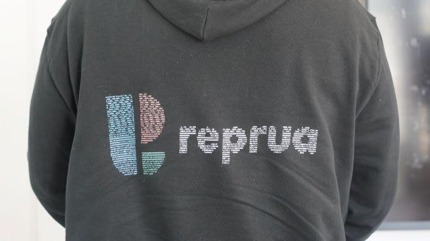
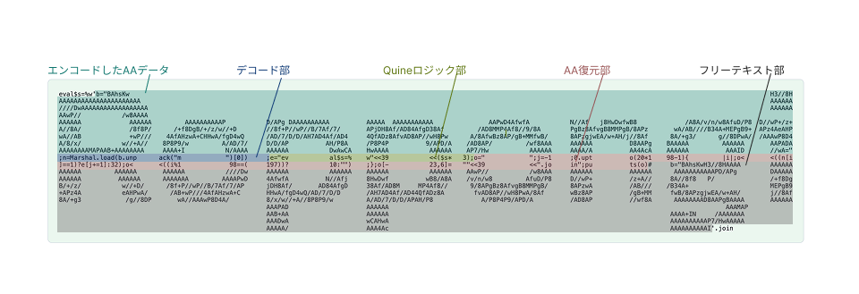

# 私と Quine の出会いと別れ、そして再会

2025/03/13

---

# 山下智矢 Yamashita Tomoya

- やまぴー・ぴーやま・ぴーさん
- 趣味
  - 読書・映画・ラーメン・ボドゲ・ポーカー
- 経歴
  - 文学部出身の本の虫
  - 2019 ~ 中小 SIer
  - 2021 ~ 株式会社 InnerResource
  - 2025 ~ 株式会社メドレー
- X→ @tyamap03 , GitHubなど→ @tyamap

---

# Quine とは

> 自身のソースコードと完全に同じ
> 文字列を出力するプログラム


---

# Quine との出会いと別れ

- 初参加・単身参加した RubyKaigi 2024 の Keynote で初めて知る
  - 感動し、Rubyの面白さに引き込まれた
- `puts "puts 'puts'..."`

--- 

# そして感動の再会

- 前職を退職する時に Quine でサービスロゴが書かれたパーカーをいただく😳
- 自分も書きたいと思い立ち、LT に申し込む

---




---

# アスキーアート Quine を書きたい

このパーカーのような、AA Quine を書きたい

---

## シンプルな Quine

```rb
eval$s=%q(puts "eval$s=%q(#{$s})")
```

---

```rb
eval$s=%q(puts "eval$s=%q(#{$s})")
```

### `eval`

- 引数の文字列をそのまま ruby コードとして実行する

### `$s`

- 変数のプレフィクスに `$` をつけることで、グローバル変数になる
- → 関数のあとの括弧やスペースを省略できる

### `%q`

- `%q()`, `%q''`, `%q{}` で囲むと、シングルクォートで囲むのと同じ


---

## 参考
- RubyでうどんげQuine(とAA型Quineの作り方講座)
  - https://mickey24.hatenablog.com/entry/20100915/ruby_udonge_quine
- RubyKaigi 2024をきっかけにQuineに入門してみた
  - https://tech.findy.co.jp/entry/2024/05/23/093756

```
AAAAAAAAAAAAAAAAAAA                                                                                                                                                                           AAAAAA
AAAAAAAAAAAAAAAAAAAAAA                                                                                                                                                                        AAAAAA
AAAAAAAAAAAAAAAAAAAAAAAA                                                                                                                                                                      AAAAAA
AAAAAA          AAAAAAA                                                                                                                                                                             
AAAAAA             AAAAAA         AAAAAAAAAAA           AAAAA AAAAAAAAAAA          AAAAA AAAAAAAAAAA               AAAAAAAAAAA           AAAAA   AAAAAAAAAA             AAAAAAAAAAAAAAAAAA AAAAAAAAA
AAAAAA             AAAAAA      AAAAAAAAAAAAAAAAA        AAAAAAAAAAAAAAAAAAAA      AAAAAAAAAAAAAAAAAAAAA         AAAAAAAAAAAAAAAAA        AAAAAAAAAAAAAAAAAAAAA      AAAAAAAAAAAAAAAAAAAAA  AAAAAAAAA
AAAAAA             AAAAAA    AAAAAAAAAAAAAAAAAAAAA      AAAAAAAAAAAAAAAAAAAAAA    AAAAAAAAAAAAAAAAAAAAAA      AAAAAAAAAAAAAAAAAAAAA      AAAAAAAAAAAAAAAAAAAAA      AAAAAAA     AAAAAAAAA  AAAAAAAAA
AAAAAA           AAAAAAA    AAAAAAA         AAAAAAA     AAAAAA          AAAAAA     AAAAAA         AAAAAAA    AAAAAAA         AAAAAAA     AAAAAA          AAAAAA    AAAAAA         AAAAAA      AAAAAA
AAAAAAAAAAAAAAAAAAAAAAA     AAAAAA           AAAAAA     AAAAAA           AAAAAA    AAAAAA          AAAAAA    AAAAAA           AAAAAA     AAAAAA          AAAAAA    AAAAAA          AAAAA      AAAAAA
AAAAAAAAAAAAAAAAAAAAA      AAAAAA            AAAAAA     AAAAAA           AAAAAA    AAAAAA          AAAAAA   AAAAAA            AAAAAA     AAAAAA          AAAAAA    AAAAAA         AAAAAA      AAAAAA
AAAAAAAAAAAAAAAAAAAA       AAAAAA             AAAAA     AAAAAA           AAAAAA    AAAAAA          AAAAAA   AAAAAA            AAAAAA     AAAAAA          AAAAAA     AAAAAAAAAAAAAAAAAAA       AAAAAA
AAAAAA         AAAAAA       AAAAAA           AAAAAA     AAAAAA           AAAAAA    AAAAAA          AAAAAA    AAAAAA           AAAAAA     AAAAAA          AAAAAA      AAAAAAAAAAAAAAAAA        AAAAAA
AAAAAA          AAAAAA      AAAAAAA         AAAAAAA     AAAAAA          AAAAAA     AAAAAA         AAAAAAA    AAAAAAA         AAAAAAA     AAAAAA          AAAAAA     AAAAAAA   AA              AAAAAA
AAAAAA           AAAAAA      AAAAAAAAAAAAAAAAAAAAA      AAAAAAA       AAAAAAAA     AAAAAAAAA    AAAAAAAA      AAAAAAAAAAAAAAAAAAAAA      AAAAAA          AAAAAA    AAAAAA                     AAAAAA
AAAAAA           AAAAAAA      AAAAAAAAAAAAAAAAAAA       AAAAAAAAAAAAAAAAAAAA      AAAAAAAAAAAAAAAAAAAAA        AAAAAAAAAAAAAAAAAAA       AAAAAA          AAAAAA    AAAAAAAAAAAAAAAAAAA        AAAAAA
AAAAAA            AAAAAAA       AAAAAAAAAAAAAA          AAAAAAAAAAAAAAAAAA        AAAAAAAAAAAAAAAAAA             AAAAAAAAAAAAAA          AAAAAA          AAAAAA     AAAAAAAAAAAAAAAAAAA       AAAAAA
                                                        AAAAAA                    AAAAAA                                                                                         AAAAAA            
                                                        AAAAAA                    AAAAAA                                                                          AAAAAAA     AAAAAAAA             
                                                        AAAAAA                    AAAAAA                                                                          AAAAAAAAAAAAAAAAAAAA             
                                                        AAAAAA                     AAAAAA                                                                            AAAAAAAAAAAAAAAAA                      
```

---

## AA Quine のポイント

### `%w` と `join`

- `%w()` でスペース区切りの要素を囲むと文字列配列になる
- 任意の箇所にスペースを書けるようになる

```ruby
eval %w(
pu  ts
  "h   e   ll  o"
).join
# => hello
```

### データ量圧縮

`Quineのソースコードで使える最大文字数 = AA中の文字の数`

---

### AA を構造データ化

AA を二進数(`0,1`)で表現
```rb
aa = <<~EOM
111111111111111111100000000000000000000000000000000000000000000000000000000000000000000000000000000000000000000000000000000000000000000000000000000000000000000000000000000000000000000000000000111111
111111111111111111111100000000000000000000000000000000000000000000000000000000000000000000000000000000000000000000000000000000000000000000000000000000000000000000000000000000000000000000000000111111
111111111111111111111111000000000000000000000000000000000000000000000000000000000000000000000000000000000000000000000000000000000000000000000000000000000000000000000000000000000000000000000000111111
111111000000000001111111000000000000000000000000000000000000000000000000000000000000000000000000000000000000000000000000000000000000000000000000000000000000000000000000000000000000000000000000000000
111111000000000000011111100000000011111111111000000000001111101111111111100000000001111100111111111110000000000000001111111111100000000000111110001111111111000000000000011111111111111111100111111111
111111000000000000011111100000011111111111111111000000001111111111111111111100000001111111111111111111110000000001111111111111111100000000111111111111111111111000000011111111111111111111100111111111
111111000000000000011111100001111111111111111111110000001111111111111111111111000001111111111111111111111000000111111111111111111111000000111111111111111111111000000111111100000011111111100111111111
111111000000000001111111000011111110000000001111111000001111110000000000111111000001111110000000000111111100001111111000000000111111100000111111000000000011111100001111110000000001111110000000111111
111111111111111111111110000011111100000000000111111000001111110000000000011111100001111110000000000011111100001111110000000000011111100000111111000000000011111100001111110000000000111110000000111111
111111111111111111111000000111111000000000000111111000001111110000000000011111100001111110000000000011111100011111100000000000011111100000111111000000000011111100001111110000000001111110000000111111
111111111111111111110000000111111000000000000011111000001111110000000000011111100001111110000000000011111100011111100000000000011111100000111111000000000011111100000111111111111111111100000000111111
111111000000000111111000000011111100000000000111111000001111110000000000011111100001111110000000000011111100001111110000000000011111100000111111000000000011111100000011111111111111111000000000111111
111111000000000011111100000011111110000000001111111000001111110000000000111111000001111110000000000111111100001111111000000000111111100000111111000000000011111100000111111100011000000000000000111111
111111000000000001111110000001111111111111111111110000001111111000000011111111000001111111110000011111111000000111111111111111111111000000111111000000000011111100001111110000000000000000000000111111
111111000000000001111111000000111111111111111111100000001111111111111111111100000001111111111111111111110000000011111111111111111110000000111111000000000011111100000111111111111111111100000000111111
111111000000000000111111100000001111111111111100000000001111111111111111110000000001111111111111111110000000000000111111111111110000000000111111000000000011111100000011111111111111111110000000111111
000000000000000000000000000000000000000000000000000000001111110000000000000000000001111110000000000000000000000000000000000000000000000000000000000000000000000000000000000000000000111111000000000000
000000000000000000000000000000000000000000000000000000001111110000000000000000000001111110000000000000000000000000000000000000000000000000000000000000000000000000000111111100000111111110000000000000
000000000000000000000000000000000000000000000000000000001111110000000000000000000001111110000000000000000000000000000000000000000000000000000000000000000000000000000111111111111111111110000000000000
000000000000000000000000000000000000000000000000000000001111110000000000000000000001111110000000000000000000000000000000000000000000000000000000000000000000000000000111111111111111110000000000000000
EOM
```

---

### AA を構造データ化

バイナリを整数に変換したものを AA の構造データとして保持する
`先頭の 0 の連続数 < 末尾の 0 の連続数`  であれば `reverse` すると節約できる

```rb
bits = aa.gsub("\n", "").reverse.to_i(2)
puts bits.to_s.size # => 1188
```

全文字数 `3980`, コード部分（1 で表現した部分）文字数 `1531` の AA が
1188 桁の整数になった

---

### 構造データをさらに圧縮

`Marshal.dump` でシリアライズし、 `Array#pack` で Base64 エンコードすることで
さらに圧縮

```rb
bin = [Marshal.dump(bits)].pack("m").gsub("\n", "")
puts bin.length # => 668
```

これで処理部分に書けるコードが増える

---

### デコードする
```rb
b = Marshal.load(b.unpack("m")[0])
```
### Quine 部分
```rb
e = "eval $s = %w" << 39 << ($s*3)         # 39: シングルクォート のASCIIコード
```

### 構造データから AA を復元してコードで置き換え
```rb
o = ""
j = -1
0.upto(20 * 198 - 1) { |i|                 # 20, 198: それぞれAAの 縦・横の長さ
   o << ((n[i] == 1) ? e[j += 1] : 32)     # 32: スペース のASCIIコード
   o << ((i % 198 == (198 - 1)) ? 10 : "") # 10: \n のASCIIコード
}
o[-17, 6] = "" << 39 << "#{end_text}"      # 最後の6文字を '.join に置き換え

```

---
以上のロジックをとして連結して `eval$s=%w'`, `'.join` で囲む

```rb
eval$s=%w'b="BAhsKwH3//8HAAAAAAAAAAAAAAAAAAAAAAAAAAAA////DwAAAAAAAAAAAAAAAAAAAAAAAAAAwP///
w8AAAAAAAAAAAAAAAAAAAAAAAAAAPD/APgDAAAAAAAAAAAAAAAAAAAAAAAAAAAAPwD4AfwfAN//Afj8HwDwfwB8/A8
A/v/n/w8AfuD/P8D//wP+/z+A//8A//8f8P//+f8DgB/+/z/w//+D//8f+P//wP//B/7Af/7/APjDH8Af/AD84AfgD
38Af/AD8MMP4Af8//9/8APgBz8AfvgB8MMPgB/8APzwA/AB////B34A+MEPgB9+APz4AeAHPwA//AB+wP///4AfAHz
wA+CHHwA/fgD4wQ/AD/7/D/D/AH7AD4Af/AD44QfADz8AfvAD8AP//wH8PwA/8AfwBz8AP/gB+MMfwB/8APzgjwEA/
w+AH/j//8Af8A/+g3/g//8DPwA//AAAwP8D4A/8/x/w//+A//8P8P9/wA/AD/7/D/D/APAH/P8A/P8P4P9/APD/A/A
D8AP//wf8AAAAAAAAAD8AAPgBAAAAAAAAAAAAAPADAAAAAAAAAMAPAAB+AAAAAAAAAAAA+IN/AAAAAAAAAADwAwCAH
wAAAAAAAAAAAP7/HwAAAAAAAAAA/AAA4AcAAAAAAAAAAID//wA=";n=Marshal.load(b.unpack("m")[0]);e="e
val$s=%w"<<39<<($s*3);o="";j=-1;0.upto(20*198-1){|i|;o<<((n[i]==1)?e[j+=1]:32);o<<((i%198=
=(197))?10:"");};o[-23,6]=""<<39<<".join";puts(o)#'.join
```

これを実行すると……

---

# 👏

```
eval$s=%w'b="BAhsKw                                                                                                                                                                             H3//8H
AAAAAAAAAAAAAAAAAAAAAA                                                                                                                                                                          AAAAAA
////DwAAAAAAAAAAAAAAAAAA                                                                                                                                                                        AAAAAA
AAwP//           /w8AAAA
AAAAAA             AAAAAA         AAAAAAAAAAP           D/APg DAAAAAAAAAA          AAAAA  AAAAAAAAAAA               AAPwD4AfwfA           N//Af   j8HwDwfwB8             /A8A/v/n/w8AfuD/P8  D//wP+/z+
A//8A/             /8f8P/      /+f8DgB/+/z/w//+D        //8f+P//wP//B/7Af/7/       APjDH8Af/AD84AfgD38Af         /AD8MMP4Af8//9/8A        PgBz8AfvgB8MMPgB/8APz       wA/AB////B34A+MEPgB9+  APz4AeAHP
wA//AB             +wP///    4AfAHzwA+CHHwA/fgD4wQ      /AD/7/D/D/AH7AD4Af/AD4     4QfADz8AfvAD8AP//wH8Pw      A/8AfwBz8AP/gB+MMfwB/      8APzgjwEA/w+AH/j//8Af      8A/+g3/      g//8DPwA/  /AAAwP8D4
A/8/x/           w//+A//    8P8P9/w         A/AD/7/     D/D/AP          AH/P8A     /P8P4P          9/APD/A    /AD8AP/         /wf8AAA     AAAAAA          D8AAPg    BAAAAA         AAAAAA       AAPADA
AAAAAAAAMAPAAB+AAAAAAAA     AAAA+I           N/AAAA     AAAAAA           DwAwCA    HwAAAA           AAAAAA    AP7/Hw           AAAAAA     AAAA/A          AA4AcA    AAAAAA          AAAID       //wA="
;n=Marshal.load(b.unp      ack("m            ")[0])     ;e="ev           al$s=%    w"<<39           <<($s*   3);o="            ";j=-1     ;0.upt          o(20*1    98-1){         |i|;o<       <((n[i
]==1)?e[j+=1]:32);o<       <((i%1             98==(     197))?           10:"")    ;};o[-           23,6]=   ""<<39            <<".jo     in";pu          ts(o)#     b="BAhsKwH3//8HAAAA        AAAAAA
AAAAAA         AAAAAA       AAAAAA           ////Dw     AAAAAA           AAAAAA    AAAAAA           AAAAAA    AAwP//           /w8AAA     AAAAAA          AAAAAA      AAAAAAAAAAAPD/APg         DAAAAA
AAAAAA          AAAAAA      AAAAAAA         AAAAPwD     4AfwfA          N//Afj     8HwDwf          wB8/A8A    /v/n/w8         AfuD/P8     D//wP+          /z+A//     8A//8f8   P/               /+f8Dg
B/+/z/           w//+D/      /8f+P//wP//B/7Af/7/AP      jDH8Af/       AD84AfgD     38Af/AD8M     MP4Af8//      9/8APgBz8AfvgB8MMPgB/      8APzwA          /AB///    /B34A+                      MEPgB9
+APz4A           eAHPwA/      /AB+wP///4AfAHzwA+C       HHwA/fgD4wQ/AD/7/D/D       /AH7AD4Af/AD44QfADz8A        fvAD8AP//wH8PwA/8Af       wBz8AP          /gB+MM     fwB/8APzgjwEA/w+AH/        j//8Af
8A/+g3            /g//8DP       wA//AAAwP8D4A/          8/x/w//+A//8P8P9/w         A/AD/7/D/D/APAH/P8             A/P8P4P9/APD/A          /AD8AP          //wf8A      AAAAAAAAD8AAPgBAAAA       AAAAAA
                                                        AAAPAD                     AAAAAA                                                                                           AAAMAP
                                                        AAB+AA                     AAAAAA                                                                            AAAA+IN     /AAAAAAA
                                                        AAADwA                     wCAHwA                                                                            AAAAAAAAAAP7/HwAAAAA
                                                        AAAAA/                     AAA4Ac                                                                            AAAAAAAAAAI'.join
```

---



---

# 学び
- さまざまな記法を知れた
- バイナリやエンコードの活用方法を学べた
- 短いコードにたくさんの知恵が詰まってる
- 複雑に見えても一つずつ紐解いていけば案外理解できる
- Ruby 面白い！

---

# Next

- 『あなたの知らない超絶技巧プログラミングの世界』を読む
- 色をつけたい
- 企業・サービスロゴで作りたい

---

# ご提案

エンジニアへのプレゼントやノベルティに Quine はいかがでしょう

---

# 感謝 🙌
