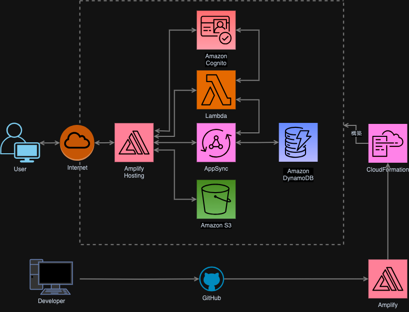
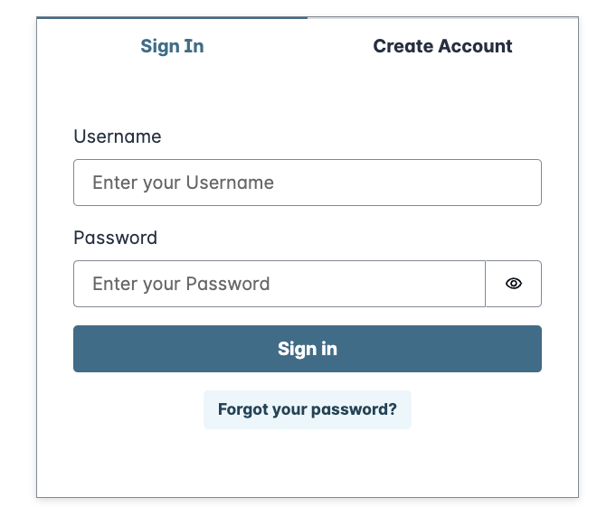
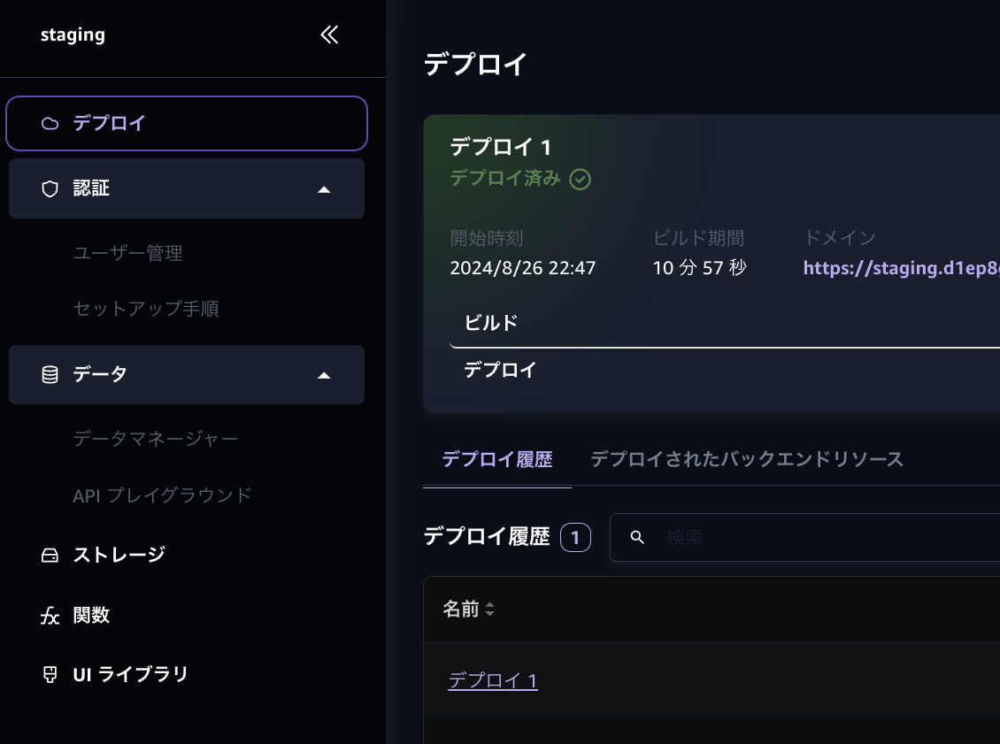

# AWS Amplify Gen2 で爆速アプリ開発

山下智矢

---

# What is Amplify

> AWS Amplify には、ウェブアプリケーションやモバイルアプリの構築に必要なものがすべて揃っています。開始もスケールも簡単です。
https://aws.amazon.com/jp/amplify/

- AWS クラウド上に web, モバイルアプリのバックグラウンドを構築するための最も簡単な方法
- 主要なバックグラウンド機能の構築と、フロントエンドとの統合を簡単に実現できる
- クラウドサービスの構築を任せて、アプリケーションの開発に集中できる

---

# Gen1 と Gen2

2024年5月から、Gen2 が GA になりました。これから始めるならGen2を使いましょう

|  Gen1 | Gen2 |
|-------|------|
| CLIとの対話やUI上でバックエンド定義ファイルを作成 | わかりやすいファイル構造と型定義により、バックエンド定義の構造が明確 |
| push することでバックエンドを構築 | バックエンド定義の変更を監視して自動で反映する Sandbox 機能 |
| CLI によるリソース管理 | CDKによるリソース管理 |

要は開発体験が格段に向上している！
以降は Gen2 の仕様で話をしていきます

---



# バックエンドの構築

```
/amplify
  ├── /auth
  │     └── resource.ts
  ├── /data
  │     └── resource.ts
  ├── /functions
  │     ├── /function_a
  │     │     ├── resource.ts
  │     │     └── handler.ts
  │     └── /function_b
  │           ├── resource.ts
  │           └── handler.ts
  ├── /storage
  │     └── resource.ts
  └── backend.ts
/src
  ├── /app
        └── pages.tsx
```

---

# バックエンドの構築

## Cognito
- 認証認可機能を提供
- SSOやソーシャルログイン
- UIライブラリとの連携でログイン基盤を速攻で実装
- Cognito API の利用でイベント制御

## AppSync + DynamoDB
- GraphQL と NoSQL DB を簡単に構築
- 柔軟なアクセス制御
- 型定義されたスキーマを利用できる

---
# バックエンドの構築

## S3
- アクセス制御されたストレージ機能を提供
- UIライブラリとの連携

## Lambda
- 関数の定義をスキーマに組み込んで型定義できる

複雑なIAMやロールによるアクセス制御を気にせずにバックエンドを構築できる
上記以外のサービスもCDKに定義することで利用可能


---



# フロントエンドの実装

- 上記で定義した内容をもとに作成されるスキーマをもとに、型定義された関数を使用できる
- バックエンドと連携したUIライブラリを使える

React で ログインフォームを作成する例

```
import { Authenticator } from '@aws-amplify/ui-react';

export default function App() {
  return (
    <Authenticator />
  );
}
```

ログインに必要な設定（ユーザー名かEmail、パスワードポリシーなど）を Cognito と連携して、自動で見た目や機能を提供してくれる

---



# デプロイ

- Amplify ホスティングでフロントエンドをデプロイ
- Amplify のコンソールUIで各サービスのリソースを管理できる

---

# 余談

- Next.js や NoSQL, GraphQL の勉強になったよ
- 今回AWSサービスをたくさん触るなかで、サービス名のプレフィックス「AWS」「Amazon」の違いが気になって調べたよ