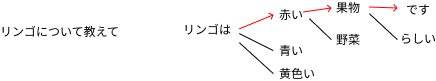

# LLM 活用の基本
## **山下 智矢**

---

# LLM とは

「LLM」は **Large Language Model（大規模言語モデル）** の略で、膨大なテキストデータをもとに、言語の理解と生成を行うAIモデルです。
ChatGPT や Perplexity などのサービスに応用されています。

---

# LLM の仕組み

テキストで与えられるリクエストに対し、
学習したデータに基づいた「確率的に正しい」「文章の続き」を生成する

---

# ハルシネーション  
「確率」や「続き」を予測するための学習データの不足やパラメータの不足により、
実際には存在しない情報を生成して「もっともらしい嘘をつく」現象が発生します

---

# 対策

### **プロンプトエンジニアリング**
最適化されたプロンプト（要求）を作成する技術
### **RAG** (Retrieval-Augmented Generation)  
データセットを元にナレッジベースを構築し、プロンプトに情報を付与する技術
### ファインチューニング
既存のモデルに新しいデータセットを学習させて、特定の分野に特化したモデルを構築する技術

---

# プロンプトエンジニアリングのコツ

下記の要素をプロンプトに組み込みましょう

- **ペルソナ**
  - 仮想的なキャラクターや立場を示す
- **タスク**
  - 具体的なタスクを明確に指示する
- **コンテキスト**
  - 十分な文脈情報を提供する
- **フォーマット**
  - 期待する出力形式を示す

---

# ノーコードでできる RAG（っぽい）実践
### **RAG** (Retrieval-Augmented Generation)  
データセットを元にナレッジベースを構築し、プロンプトに情報を付与する技術

- **MyGPTs**
  - OpenAI有料プランで利用可能
- **Google NotebookLM**
  - 無料で利用可能

---

# 終わりに

LLMやAIサービス効果的に利用していきましょう
