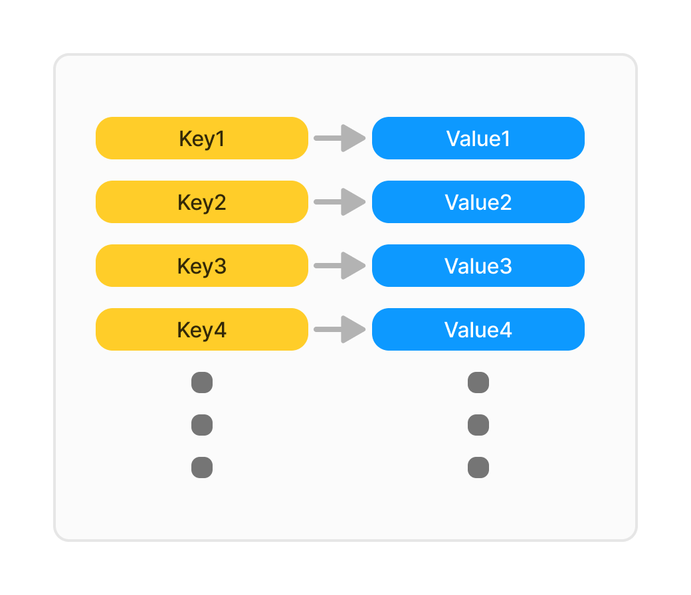

# とりあえず知っておきべきNoSQL
## yamashita

---

# NoSQL とは

- NoSQLは「Not Only SQL」の略
  - 「SQLではない」ではなく「SQLだけじゃないよ」
- 非構造化データや多様なデータ形式に対応するデータベース
- 主にスケーラビリティと柔軟性を重視した設計

---

# RDBとの違い

## RDB
- 厳密なスキーマで高度に構造化
- 垂直スケーリング（サーバーの性能向上）が適している
- ACID特性: トランザクションの一貫性・完全性でデータの整合性を重視

## NoSQL
- スキーマレスで柔軟にデータを保存
- 水平スケーリング（サーバーの台数追加）が適している
- BASE特性: 整合性より可用性、柔軟性を重視

---

# キーバリュー型

- シンプルなデータモデル：キーと値のペア
- キーによる高速なデータアクセス
- 例: Redis、Amazon DynamoDB
- 用例: キャッシュ、セッション管理、リアルタイムデータ

---

# ドキュメント指向型

- データをJSON形式などのドキュメントとして保存
- KVS のキーがドキュメントに紐づいているイメージ
- 柔軟なデータ構造を持ち、階層的なデータをサポート
- 例: MongoDB、CouchDB
- 用例: ウェブアプリ、モバイルアプリ

---

# グラフ指向型

- ノードとエッジでデータの関係を表現
- 複雑な関係データを効率的に扱うことが可能
- 例: Neo4j、Amazon Neptune
- 用例: ソーシャルネットワーク、レコメンデーションエンジン

---

# その他

他にもいろいろ
- カラム指向データベース
  - KVS をさらに拡張したイメージ
  - 例: Cassandra
- 時系列データベース
- マルチモデルデータベース

---

# まとめ

- NoSQLは柔軟性とスケーラビリティに優れたデータベース
- データ構造によってさまざまな種類がある
- 要件に合わせて最適なデータベースを選択したい
- NoSQLの厳しさはやはり「SQLではない」ことによる学習コストの高さ、設計の難しさにある
- アプリケーションDBとは別で、データ分析ツールや一部の機能として何か作って見て学習するのが良さそう
