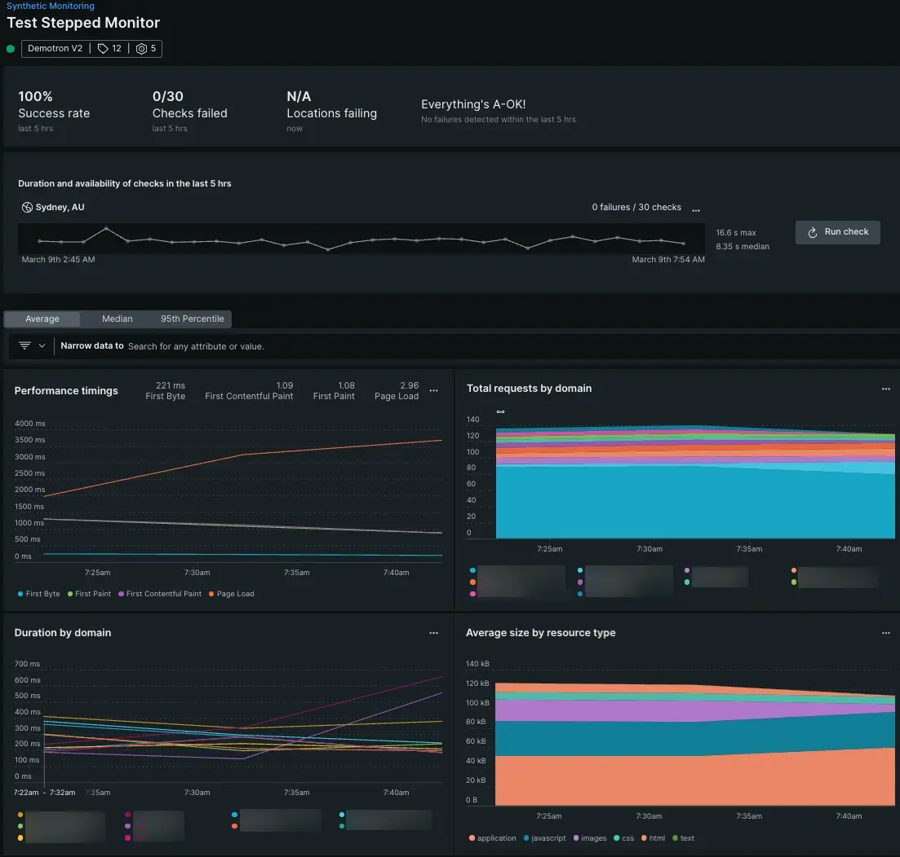

# 今日からできる！NewRelic便利機能紹介

author
: 山下智矢

institution
: 株式会社Inner Resource

# 何をするか

{:.center}
{::tag name="large"}O11y ツール NewRelic の{:/tag}
{::tag name="large"}普段はあまり触らない機能を{:/tag}
{::tag name="large"}トラブルシュート形式で紹介{:/tag}

# やらないこと

- NewRelic とは何かの説明
- メトリクスの見方などの細かい部分

# 出典

技術書典2023 で購入した本を参考にしています

{:relative_width="22"}

{:.center}
{::tag name="x-small"}https://techbookfest.org/product/mH7sfRsGupWnvD8iECpAdz{:/tag}

# アジェンダ

- 問題のあるコードを特定したい
  - CodeStream
- システムがちゃんと動いてるか確認したい
  - Synthetic Monitoring
- Observability as Code したい
  - Terraform NR provider

# 問題のあるコードを特定したい

トレースやエラーが可視化されても、
ソースコードのどこに問題があるかはわからない……

{::wait/}{::tag name="large"}NewRelic と CodeStream を連携しよう！{:/tag}

# 問題のあるコードを特定したい

1. CodeStream アカウントを作成
2. IDE 上で CodeStream にログイン
3. NewRelic でリポジトリ連携

# 問題のあるコードを特定したい

トレースやエラーから、IDEを開いてソースコードにアクセス！

{:relative_width="50"}

{:.center}
{::tag name="small"}CodeStream には他にも便利機能があるかも{:/tag}

# ちゃんと動いてるか確認したい

新しい機能や普段あまり使われない機能でエラーが起きたりしたらどうしよう……
そもそもシステムや機能がちゃんと動いているかわからない……

{::wait/}{::tag name="large"}SyntheticMonitoring で外形監視しよう！{:/tag}

# ちゃんと動いてるか確認したい

1. 監視したいURLを登録するだけ！
2. Selenium スクリプトも書ける

# ちゃんと動いてるか確認したい

結果を確認！

{:relative_width="45" align="right" relative_margin_right="-10"}

{::tag name="small"}Standardプランで{:/tag}
{::tag name="small"}毎月10,000チェックまで使えるよ{:/tag}

# Observability as Code したい

UIでポチポチ構築すると再利用性や一貫性がない……
バージョン管理もできないのでチームでの運用がしにくい……

{::wait/}{::tag name="large"}Terraform で OaC を実践しよう！{:/tag}

# Observability as Code したい

1. Terraform CLI をインストール
2. Terraform コードを書く
3. `terraform apply` でデプロイ

# Observability as Code したい

あらゆるNR機能を OaC で構築して管理を一本化！

{::tag name="small"}NewRelic CLI もあるよ{:/tag}

# おわりに

- 他にも便利機能がたくさん！
  - Ask AI
  - Workload
  - Workflow...
- 気になる機能はどんどん共有してください
- ユーザーグループもあります
  - https://nrug.connpass.com/

# リンク

- CodeStream
  - https://docs.newrelic.com/docs/codestream/start-here/what-is-codestream/
- Synthetic Monitoring
  - https://docs.newrelic.com/docs/synthetics/synthetic-monitoring/getting-started/get-started-synthetic-monitoring/
- Terraform NR provider
  - https://docs.newrelic.com/docs/infrastructure-as-code/terraform/terraform-intro/